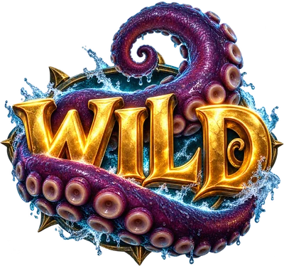
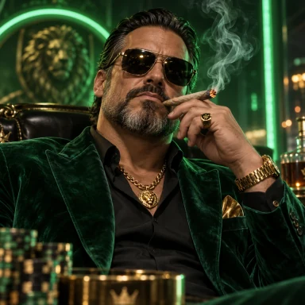

<div align="center">

# Casino Suite

**Premium play-money casino games for the web: two slots, Blackjack and Texas Hold'em.**
Built with PixiJS · runs on desktop, tablet and phone (portrait and landscape) · German & English

<br>

&nbsp;&nbsp;
&nbsp;&nbsp;
&nbsp;&nbsp;


<br>


</div>

---

## The games

| | Game | Highlights |
|---|---|---|
|  | **Kraken's Hoard** | Pirate tumble slot on a ship deck that breaks open from 4 to 8 rows (up to 262,144 ways). Kraken strikes turn whole reels wild with ×2–×10 multipliers, three free-spin "storms" to choose from, *Kraken's Wrath* (three wild reels at once), bonus buy. Max win 10,000×. |
|  | **Haze Kings 420** | 7×7 cluster-pays tumble slot with a persistent Hotbox multiplier grid up to ×64, Munchies free spins, Cloud 9 super bonus, Lucky Lighter and bonus buys. Max win 5,000×. |
|  | **Blackjack** | 6-deck shoe, dealer stands on all 17s, Blackjack pays 3:2, double after split, split up to 4 hands, insurance and even money. |
|  | **Texas Hold'em** | No-limit table against 5 AI opponents with distinct styles, raise slider and presets, side pots, showdown highlights — plus **Kush or Better**, a 9/6 Jacks-or-Better video poker with an exact-EV hint. |

All games share one play-money wallet, a premium start screen, sound design with a synthesized fallback, procedural background music, and a DE / EN language switch.

## Honest by design

- **Fair randomness.** Card shoes and poker decks are shuffled with `crypto.getRandomValues`. The poker AI never sees your hole cards (covered by tests).
- **Measured payout rates.** The slot maths are pure, step-based modules; the renderers only play the steps back. Monte-Carlo simulations in [`scripts/`](scripts) verify them:
  - Kraken's Hoard ≈ 98 % RTP (1M spins per free-spin storm)
  - Haze Kings 420 ≈ 98.1 % RTP (4M spins; high volatility, ±1.5 % at that sample size)
  - Blackjack house edge ≈ 0.4 % with basic strategy (1M-hand simulation)
  - Kush or Better uses the standard 9/6 paytable (99.54 % with perfect play)
- **No rigged near-misses and no losses disguised as wins.** Every payout is rounded to cents and each game keeps an audit ledger (`?debug`).

These numbers come from simulation, not from a certification lab — see the gambling clause in the [license](LICENSE.md).

## Quick start

```bash
npm install
npm run dev          # http://localhost:5190
npm run build        # static files in dist/
npm test             # engine, evaluator, hold'em and AI tests
npm run sim:kraken   # RTP simulations (also sim:haze, sim:blackjack)
```

## Embedding

Every game is a standalone page (`krakens-hoard.html`, `haze-kings.html`, `blackjack.html`, `poker.html`) and can be embedded in an `<iframe>`:

| Parameter | Effect |
|---|---|
| `?embed=1` | Embedded mode: no fullscreen request, no lobby button (also detected automatically inside an iframe) |
| `?lang=de` / `?lang=en` | Language (otherwise: saved choice, then browser language) |
| `?debug` | Exposes a test driver (`KH`, `HK`, `BJ`, `PK`) and the audit ledger in the console |

The balance lives in `localStorage` (`arcade.balance`) and is shared by all games on the same origin.

## Tech

Vite · PixiJS 8 · plain ES modules, no framework. Canvas-rendered text with a dark plaque behind every result message for legibility on any background. Card faces are drawn lazily, oversized artwork is pre-scaled (`npm run optimize:assets`), and blurred backgrounds are baked once instead of filtered every frame, so the games stay light on phones.

```
src/games/krakens-hoard   slot: math.js (pure) + main.js (renderer)
src/games/haze-kings      slot: math.js (pure) + main.js (renderer)
src/tables/blackjack      engine.js (pure, tested) + main.js
src/tables/poker          evaluator / holdem / ai / videopoker (pure, tested) + main.js
src/tables/kit            cards, chips, crypto shuffle, embed helpers
src/shared                wallet, i18n, motion, sound, music, start screen
```

## License

**Free for non-commercial use** — personal projects, learning, game jams, portfolios, schools and non-profits — as long as you show a visible credit with a link:

> Games by **Dominik Bloechinger** – [Casino Suite](https://github.com/fiveworld-development/casino-suite)

**Commercial use needs a paid license** — one-time per product, no royalties. Indie from € 290, Studio € 1,490, Enterprise / white-label on request. Real-money or crypto gambling only with an explicit Operator license.

→ Full terms: [LICENSE.md](LICENSE.md) · Pricing & how to buy: [COMMERCIAL.md](COMMERCIAL.md) · Third-party material: [THIRD_PARTY.md](THIRD_PARTY.md)

## Responsible play

This project contains **no real-money gambling**: no deposits, no withdrawals, no prizes. It is intended for adults (18+). If gambling is a problem for you or someone close to you, help is available — e.g. [BZgA check-dein-spiel.de](https://www.check-dein-spiel.de) (DE) or [BeGambleAware](https://www.begambleaware.org) (UK).

---

<div align="center">Made by <b>Dominik Bloechinger</b> · © 2026</div>
