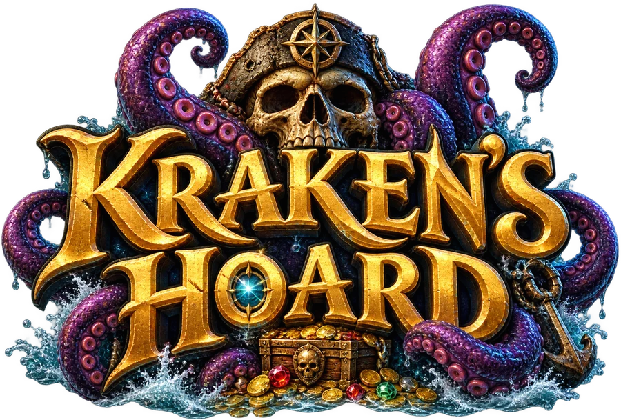
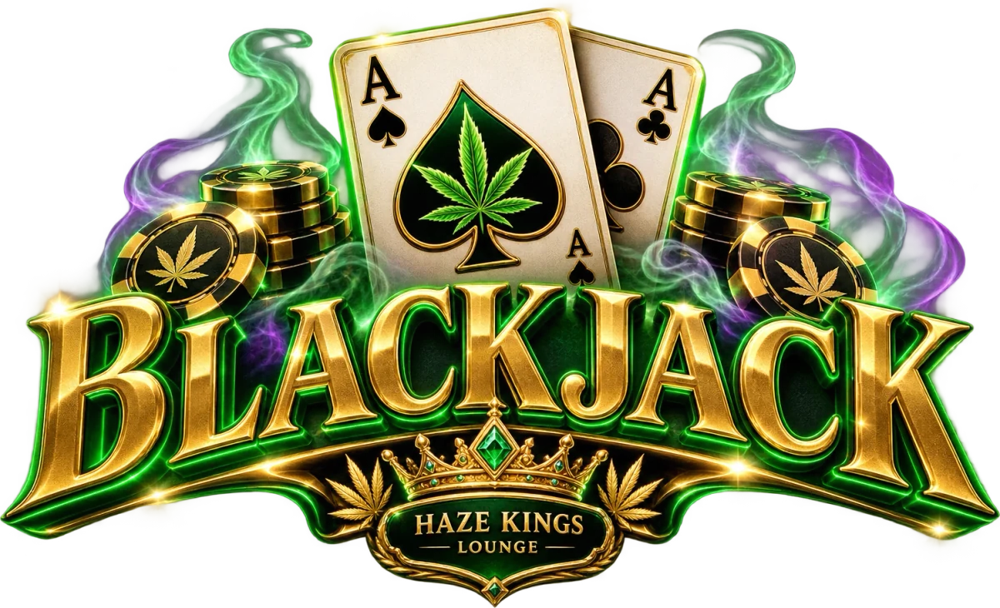
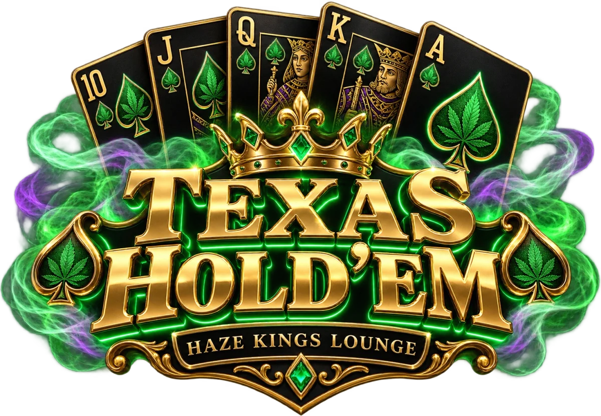
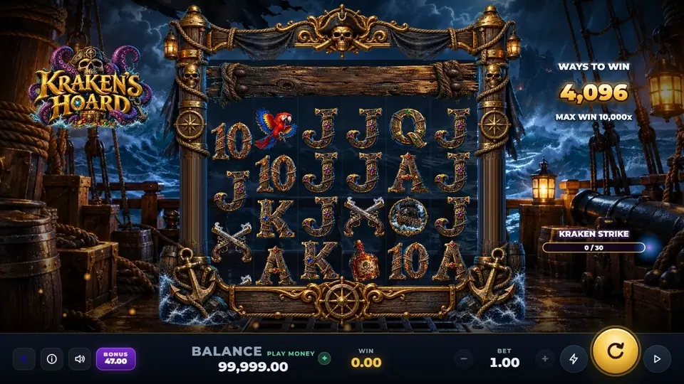
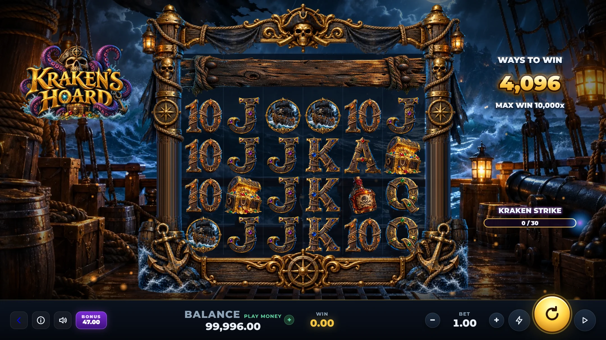
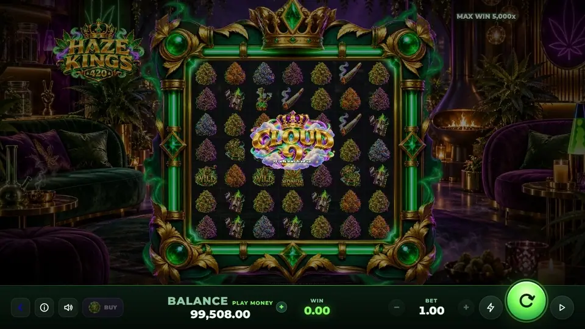
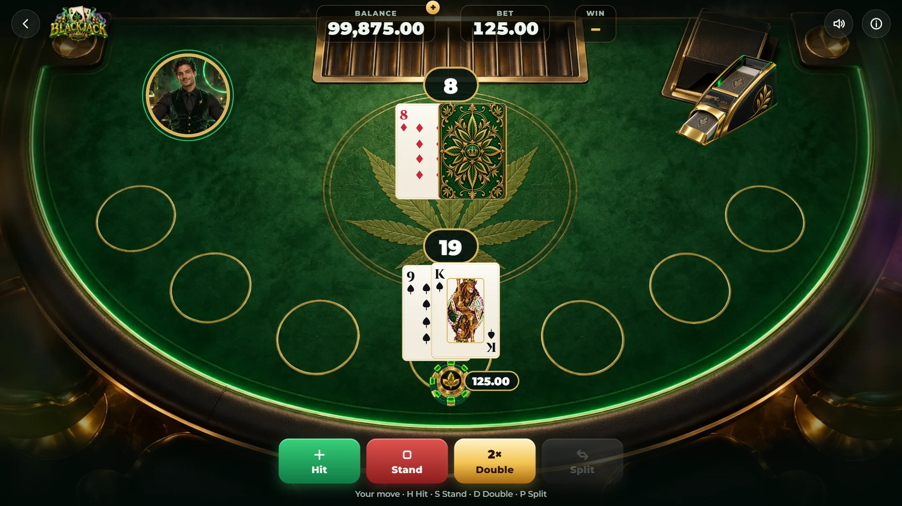
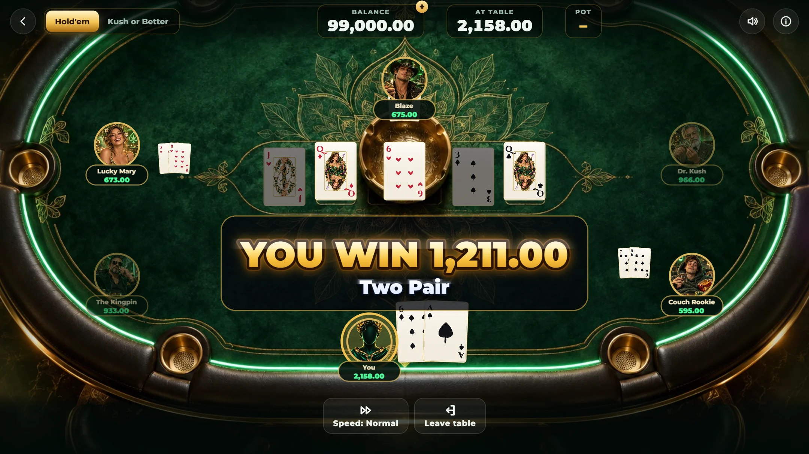
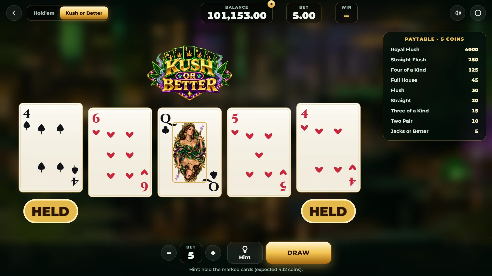
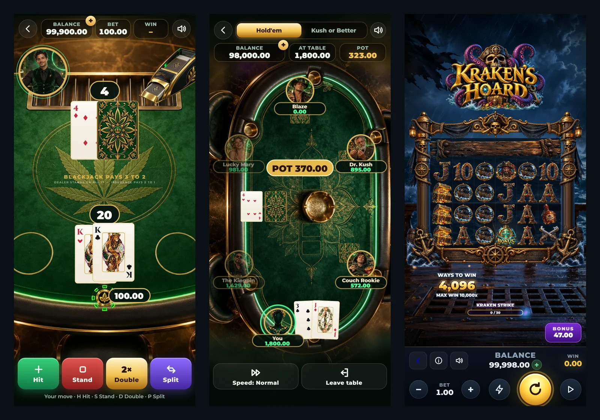

<div align="center">

&nbsp;
&nbsp;
&nbsp;


# Casino Suite

A small casino you can drop into any website or game.<br>
Two slots, Blackjack and Texas Hold'em. Play money only, in the browser, on any screen.

### [Play it in your browser →](https://fiveworld-development.github.io/casino-suite/)



</div>

<br>

I started this because I needed a casino for the in-game phone of another project, and everything I found was either a dated HTML5 template or a slot that looked nice but paid out whatever it felt like. So I built my own. Four games, each with real maths behind it, tuned until they felt good to play on a laptop and on a phone held sideways under the table.

Everything runs on play money. There is no deposit, no withdrawal and nothing to win except the fun of watching the Kraken wreck your reels.

<br>

## The games

### Kraken's Hoard

[Play Kraken's Hoard](https://fiveworld-development.github.io/casino-suite/krakens-hoard.html)

A pirate slot on the deck of a ship in a storm. Every winning tumble blasts a plank off the deck, and the deck stays open between spins, so the reels grow from 4 to 8 rows and from 4,096 to 262,144 ways to win. Fill the Kraken meter and a tentacle slams down on a reel, turning it wild with a multiplier. In the free spins you pick your own storm: lots of spins, a sticky Kraken reel from the start, or *Kraken's Wrath*, where three reels go wild at once.



### Haze Kings 420

[Play Haze Kings 420](https://fiveworld-development.github.io/casino-suite/haze-kings.html)

A 7×7 cluster slot in a lounge floating above the clouds. Wins light up the cells underneath them, and every further hit on a lit cell doubles its multiplier, up to ×16. The *Hotbox* stays lit from spin to spin until a dead spin clears it, so a good streak really carries. The Cloud 9 bonus starts with the grid already glowing.

<div align="center"></div>

### Blackjack

[Play Blackjack](https://fiveworld-development.github.io/casino-suite/blackjack.html)

Six decks, dealer stands on all 17s, Blackjack pays 3:2. You can double after splitting and split up to four hands, and you get insurance and even money when the dealer shows an ace. The table always shows your best total, never "7/17".



### Texas Hold'em and Kush or Better

[Play Texas Hold'em and video poker](https://fiveworld-development.github.io/casino-suite/poker.html)

A no-limit table against five AI players who each play differently. The Kingpin plays few hands but hits hard, Lucky Mary calls almost everything, Blaze bluffs far too often, Dr. Kush does the pot-odds maths, and the Couch Rookie is simply unpredictable. None of them can see your cards; the tests make sure of that. Next door is **Kush or Better**, a classic 9/6 Jacks or Better video poker with a hint button that works out the mathematically best hold.





<br>

## On a phone

Every game has its own layout for phones in portrait and landscape, tablets and desktops. I didn't want one layout squeezed to fit.



<br>

## Fair numbers

I care about this part, so here is exactly what I checked.

The slots are split into a pure maths module and a renderer that only plays back what the maths decided. That makes them easy to simulate, and the scripts in [`scripts/`](scripts) do exactly that:

| Game | Result | Sample |
|---|---|---|
| Kraken's Hoard | 98.2 % RTP (95.3 % at the 10,000 cap) | 2 million spins, all features running |
| Haze Kings 420 | 97.7 % RTP (97.5 % at the 10,000 cap) | 3 million spins, all features running |
| Blackjack | about 0.4 % house edge with basic strategy | 1 million hands |
| Kush or Better | 99.54 % with perfect play | standard 9/6 paytable |

One round (a spin plus every bonus it triggers) pays at most 150× the bet and never more than 10,000. On Kraken's Hoard a win of 5× or more comes about every 25 spins, 20× about every 120, 50× about every 430 and 100× about every 1,250.

Cards are shuffled with the browser's cryptographic random generator. There are no fake near-misses and no losses dressed up as wins. Every game keeps a ledger you can check with `?debug`.

These are simulation results, not a lab certificate. If you ever want to use the games with real money, read the gambling section of the [license](LICENSE.md) first.

<br>

## Try it

```bash
git clone https://github.com/fiveworld-development/casino-suite.git
cd casino-suite
npm install
npm run dev
```

Then open http://localhost:5190. `npm run build` gives you a static folder you can host anywhere, and `npm test` runs the engine tests.

### Putting it into your own project

Each game is a normal page (`krakens-hoard.html`, `haze-kings.html`, `blackjack.html`, `poker.html`) that also works inside an `<iframe>`.

| Add to the URL | What it does |
|---|---|
| `?embed=1` | Hides the lobby button and skips fullscreen. Also switches on automatically inside an iframe. |
| `?lang=en` or `?lang=de` | Picks the language. Without it the game uses the last choice or the browser language. |
| `?debug` | Adds a test driver and the payout ledger to the console. |

All games share one balance through `localStorage`, so winnings in the slots can be lost again at the poker table, just like in a real casino.

<details>
<summary><b>How it's built</b></summary>

<br>

Vite and PixiJS 8, plain JavaScript modules, no framework.

```
src/games/krakens-hoard   slot maths (math.js) and renderer (main.js)
src/games/haze-kings      slot maths (math.js) and renderer (main.js)
src/tables/blackjack      rules engine with tests, table renderer
src/tables/poker          hand evaluator, Hold'em engine, AI, video poker solver
src/tables/kit            cards, chips, shuffling, embed helpers
src/shared                wallet, translations, animation, sound, music, start screen
```

A few things that keep it light on phones: card faces are only drawn when a card is first shown, artwork is scaled to the largest size it is ever displayed at (`npm run optimize:assets`), and the blurred room behind the tables is computed once instead of every frame. The screenshots and animations in this README are made by `scripts/screenshots.js` and `scripts/record.js`.

</details>

<br>

## License

**Free for anything non-commercial.** Personal projects, learning, game jams, your portfolio, schools, clubs and non-profits can all use it for free. The only thing I ask is a visible credit with a link, somewhere players can actually see it:

> Games by **Dominik Bloechinger** – [Casino Suite](https://github.com/fiveworld-development/casino-suite)

**Making money with it?** Then you need a commercial license. It's a one-time fee per product with no royalties: € 290 for indies, € 1,490 for studios, and an individual offer for bigger companies and white-label use. If you're not sure whether your project counts as commercial, just ask. Real-money gambling is only possible with a separate operator agreement.

[Full license](LICENSE.md) · [Commercial licenses](COMMERCIAL.md) · [Sounds, fonts and libraries](THIRD_PARTY.md)

<br>

## Play responsibly

These games are made for adults and use play money only. If gambling stops being fun for you or someone close to you, help is out there: [check-dein-spiel.de](https://www.check-dein-spiel.de) in Germany or [BeGambleAware](https://www.begambleaware.org) in the UK.

<br>

<div align="center">
<sub>Made by Dominik Bloechinger · 2026</sub>
</div>
